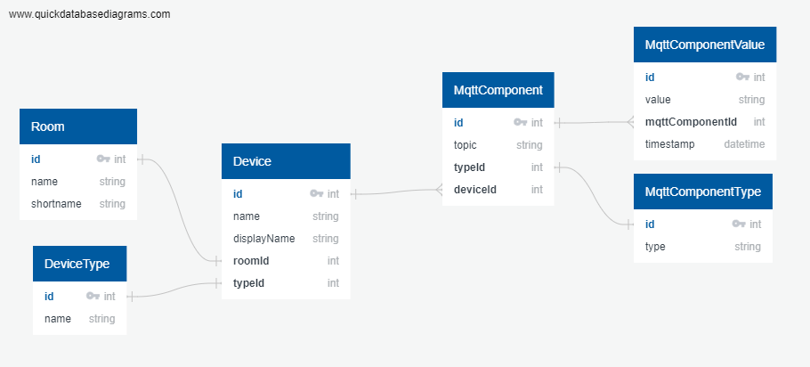

# QingLong

QingLong -- Blue Dragon -- uses EntityFramework as ORM for the Database and provides a CRUD REST API to interact with the ORM.

## Overview



## Getting Started

```PowerShell
dotnet restore
```

```PowerShell
dotnet run
```

### Init DB Manually

1. Create Room
   1. name=Kitchen
   2. shortname=kitchen
2. Create MqttComponentType
   1. type=sensor
3. Create MqttComponent
   1. topic=the-verse/kitchen/temperature
   2. typeId=1
4. Create another MqttComponent
   1. topic=the-verse/kitchen/humidity
   2. typeId=1
5. Create DeviceType
   1. name=NodeMCU
6. Create Device
   1. name=motherloore01
   2. displayName=NodeMCU Kitchen
   3. roomId=1
   4. typeId=1
   5. MqttComponentIds=[1,2]

## Docker Notes

### Build

```PowerShell
docker build -f Dockerfile -t rootthekid/qing-long:latest .
```

### Push

```PowerShell
docker push rootthekid/qing-long:latest
```

### Run

```PowerShell
docker run --rm -p 8801:80 --name qing-long rootthekid/qing-long:latest
```

## EF Notes

```PowerShell
dotnet ef migrations add InitialCreate
```

```PowerShell
dotnet ef database update
```
